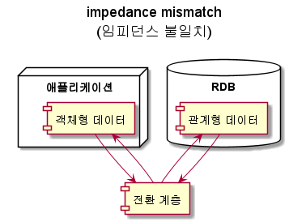
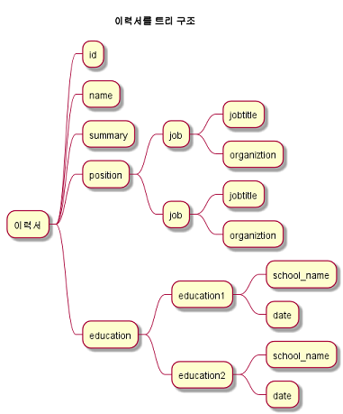

# 데이터 모델과 질의 언어
## 데이터 모델이란?
* 데이터의 관계, 접근과 그 흐름에 필요한 처리 과정에 관한 추상화된 모형이다.
* 소프트 웨어에서 개발과 유지, 보수의 기준이 되기 때문에 소프트웨어 공학의 중요한 이슈 이다. 
* 데이터 모델은 데이터 구조를 결정한다.
* 위키 : https://ko.wikipedia.org/wiki/%EB%8D%B0%EC%9D%B4%ED%84%B0_%EB%AA%A8%EB%8D%B8
###### <br>
## 데이터 모델의 예제 
* 대부분의 애플리케이션은 하나의 데이터 모델을 다른 데이터 모델 위에 계층을 둬서 구현한다.
* 애플리케이션 개발자
  * 현실을 기반으로 객체나 데이터 구조 및 API를 모델링한다. 
* 데이터 구조
  * JSON이나 XML문서, RDB테이블, 그래프 모델같은 범용적 모델로 표현한다.
* 데이터 베이스 소프트웨어 개발자
  * 데이터 구조의 데이터들을 메모리, 디스크 또는 네트워크 상의 바이트로 표현하는 방법을 결정합니다. 
  * 이 표현은 다양한 방법으로 데이터를 질의, 탐색, 조작, 처리를 지원합니다. 
* 하드웨어 엔지니어는 전류, 빛의 파동, 자기장등의 관점에서 바이트를 표현합니다. 
###### <br>
## 데이터 모델의 이점
* 명확한 데이터 모델을 통해서 하위 계층을 복잡성을 감춥니다. 
* 이를 통해서 다른 그룹의 사람들이 효율적으로 일할 수 있음
  * 데이터 베이스 벤더의 엔지니어
  * 데이터 베이스를 사용하는 사용자 
###### <br>
## 관계형 모델과 문서 모델
### 관계형 모델
* 1970년에 에드가 코드에 의해서 제안됨
* 데이터는 Relation(테이블)로 구성되며 테이블은 Tuple(행)으로 표현됩니다.
* 가장 잘 알려진 데이터 모델
* RDBMS와 SQL로 정규화된 구조로 데이터를 저장하고 질의가 필요한 곳에 채택됨
###### <br>
### 관계형 모델 예제
**UserInfo Relation(테이블)**
|UserID|UserName|Age|
|:--:|:--:|:--:|
|1234|ahn|31|
|1235|jung|25|
|1236|woong|44|
###### <br>
### NoSQL의 탄생
#### NoSQL의 뜻은 "Not Only SQL"의 줄임말이며 RDB를 사용하지 않는다는 뜻이 아닌 여러 유형의 데이터 베이스를 사용한다는 뜻을 가집니다. 
#### NoSQL은 특정 데이터 모델을 지칭하지 않습니다. 
#### 다만 아래의 특징을 가집니다
* 대부분의 오픈 소스로 제공
* 관계형의 스키마 제한사항을 개선하기 위한 Schema-less 형태 지원
* 대규모의 데이터 셋이나 높은 쓰기 처리량을 위한 확장성 지원 
#### [웹2.0](2.데이터_모델과_질의언어_appendix.md) 환경과 [빅테이터](2.데이터_모델과_질의언어_appendix.md)가 등장하면서 RDBMS의 데이터 처리 비용의 증가(scale up)로 인한 개선 필요
#### 데이터의 일관성을 포기한 대신에 여러 대의 컴퓨터에서 분산해서 저장하는 것을 목표로 개발됨
###### <br>
### 객체 관계형 불일치 
#### 오늘날의 대부분의 애플리케이션은 객체 지향 프로그래밍 언어로 개발됨
#### 애플리케이션의 데이터를 RDB로 저장하려면 아래와 같은 전환 계층 필요
#### 
#### [액티브 레코드](2.데이터_모델과_질의언어_appendix.md)나 [하이버 네이트](2.데이터_모델과_질의언어_appendix.md) 같은 관계 객체형 매칭 프레임워크도 있지만 완벽지원 불가
#### RDBMS에서 일대다(one-to-many) 표현
1. 전통적인 SQL모델에서는 외래키 참조 방법으로 표현
2. SQL3에서는 구조화된 데이터 타입 및 xml 데이터 지원
   * Mysql 5.7부터 Json 데이터 지원 
3. JSON이나 XML형식으로 부호화해 텍스트 컬럼에 저장 한후 애플리케이션 레벨에서 해석
   * 단점으로 부호화된 값을 질의 할 수 없음
#### 일대다 형식은 JSON으로 표현으로 적합하게 가능함
* 예를 들어 이력서를 하나의 JSON 문서로 표현 가능 
* 일대다 형식은 데이터 트리 구조와 같기 때문에 JSON표현에 명시적으로 확인됨
```json
{
  "user_name" : "woong",

  ... 생략

  "position": [
    {"jontitle" : "사원", "organization": "amazone"},
    {"jontitle" : "대리", "organization": "ncsoft"}
  ]
}
```

#### 몽고DB, 리싱크DB, 카우치DB, 에소프레소같은 **문서 지향 데이터** 베이스는 JSon 데이터 모델을 지원
#### 관계형에 비해서 JSON 형식의 장점
* 더 나은 [지역성](2.데이터_모델과_질의언어_appendix.md)을 갖음
  * 관계형에서는 일대다 정보를 획득하려면 다중 질의나 다중 조인을 수행 필요
  * JSON에서는 한 곳에 모든 정보가 있기 때문에 하나의 질의로 수행 가능 
###### <br>
### 다대일(many-to-one) 관계와 다대다(many-to-many) 관계 
#### 다대일 관계를 사용해야 하는 이유
* 중복 데이터 제거 
* 데이터 변경시 쓰기 오버헤드와 불일치 발생 제거
#### 다대일 관계의 경우 문서모델로 표현하기 적합하지 않습니다.
* 관계형 DB의 경우 join을 쉬움
* 문서형 DB의 경우 join에 대한 지원이 약함
  * 현재 시점에서 문서형 DB중에 가장 많이 쓰이는 MongoDB를 기반으로 Join에 대한 지원 조사 필요

#### 관계형 DB에서는 외래키를 통한 조인을 통해서 질의
#### 문서형 DB에서는 관계형에서 외래 키라고 부르는 것과 같은 기능을 하는  [**문서 참조(document reference)**](./2.데이터_모델과_질의언어_appendix.md) 를 지원합니다. 
###### <br>

## 맵리듀스(MapRedudce)
* MapRedudce란 많은 컴퓨터에서 대량의 데이터를 처리하기 위한 프로그래밍 모델로 구글에 의해서 알려짐
* 몽고DB와 카우치 DB를 포함한 일부 NoSQL에서 제한된 형태의 MapReduce를 지원합니다. 
* MapRedudce는 특이하게 명령형도 아니고 선언형도 아닌 형태를 가집니다.
#### 예제 sql 문법
```sql
-- postgresql
SELECT date_trunc('month', observation_timestamp) AS observation_month,
sum(num_animals) AS total_animals
FROM observations
WHERE family = 'Sharks'
GROUP BY observation_month;
```
#### 예제 MapReduce 문법
```jsp
db.observations.mapReduce(
  function map() {
    var year = this.observationTimestamp.getFullYear();
    var manth = this.observationTimestamp.getMonth() + 1;
    emit(year + "-" + month, this.numAnimals);
   },
   function reduce(key, values){
     return Array.sum(values);
   },
   {
     query : { family : "Sharks"},
     out : "monthlySharkReport"
   }
);
```

## 정리
* 역사적으로는 트리 구조로 데이터를 처리하려고 했으나 다대다 관계를 표현하기 위해서 관계형 모델이 고안되었음
* 하지만 시간이 지나면서 관계형으로 해결될 수 없는 것을 위해서 "NoSQL"이 고안됨
  * **문서 데이터베이스**는 데이터가 문서 자체에 포함되어 있으면서 하나의 문서와 다른 문서간의 관계가 거의 없는 사용 사례를 대상으로 한다.
  * **그래프 데이터베이스**는 문서 데이터 베이스와 정반대로 모든 것이 잠재적으로 관련 있다는 사용 사례를 대상으로 한다. 
* 문서, 관계, 그래프 모두 서로를 흉내낼 수 있지만 결과는 좋지 않으며 자기의 목적에 맞게 사용되어야 한다.
* 