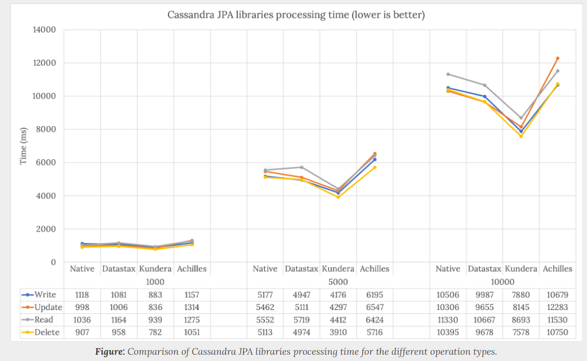
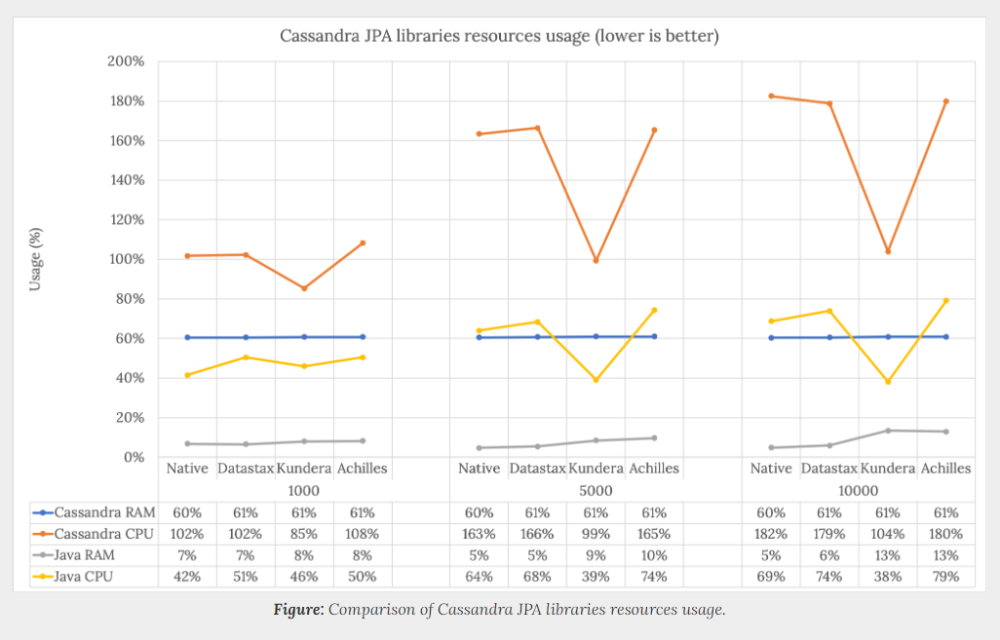

## Spring과 연동 할 수 있는 JPA 라이브러리 목록 
* Native
* Achilless
* Datastax
* Kundera
#### 테스트 환경 
* Java 8
* Maven
* Docker
* Docker Compose

## 아파치 카산드라
### 카산드라는 대규모 애플리켕션을 위해 설계된 오픈소스이고 컬럼 기반 데이터베이스이며 단일 장애 지점없이 가용성으로 대량을 데이터를 처리합니다. 
### 페이스북에서 개발되었고 현재는 Apache Software Foundation 일부입니다.
### 요즘에는 가장많이 사용되는 NOSQL중에 하나입니다. 

## 어떻게 JPA를 비교할 것인가?
### 카산드라용 여러개의 JPA라이브러리의 공정한 성능 및 리소스 사용량 비교를 위해서 
### 다음과 같은 여러 질문들을 분석하고 고령하는 것이 중요합니다. 
* 데이터베이스의 어떤 작업들을 수행을 비교 해야 하나요?
* 어떤 데이터 타입을 고려해야 하나요?
* 데이터 복잡도는 어떻간요?
* 어떠한 지표로 성능을 판단하나요?
* 성능 지표을 어떻게 측정하고 수집하나요?
* 외부 조건의 영향을 받지 않고 일관된 결과를 어떻게 수집할까요?
  
### 테스트 가이드 라인
* 작업 타입 : write, read, update, delete
* 데이터 타입 : Relation이 없는 단순한 단일 테이블 
* 데이터 특이사항 : 모든 수행 작업은 캐싱을 피하기 위해서 고유한 데이터로 수행되어야 합니다. 
* 성능 측정 : 각 작업이 수행된 시간 
* 자원 사용량 측정 : 클라이언트와 서버의 CPU와 RAM 사용량
* 반복 요소 : 모든 테스트는 단일 실행 결과가 아닌 여러 수행의 평균값을 수집합니다. 

## 결과 
* 테스트 환경 : macOS Macbook 4cores 2.3GHz and 16GB RAM
* Docker위에서 카산드라와 Java 애플리케이션 구동
* 작업 수행 수 : 1000, 5000, 10000
* 반복횟수 : 3회 
* 사이클 수 : 3회 
  
### JPA 수행 속도 비교
#### Kundera가 가장 빠른 속도를 제공합니다. 
#### Achiles가 가장 나쁜 성능을 보여줍니다. 
#### 성능차이는 이 표에서는 3.2초이지만 1000만번 수행한다면 대략 1시간 정보의 차이를 보입니다. 
#### [다른 JPA에 비해서 Kundera의 이점]
|JPA|성능차이|
|:--:|:--:|
|Achile|28%|
|Datastax|19%|
|Native|24%|
#### Kundera는 Achille보다 28%
#### 
######  
### 자바 애플리케이션 및 카산드라의 CPU와 RAM 성능 비교
#### Kundera는 카산드라 및 JAVA 애플리케이션 모두에서 CPU 사용량이 현저히 낮습니다. 
#### 하지만 Datastax보다 더많은 Ram을 사용합니다.
#### Kundera는 카산드라에 데이터을 전달하기 전에 Ram위에 작업들 보유합니다. 
#### 

## 참조 사이트 
* https://hands-on-tech.github.io/2019/01/13/cassandra-jpa-example.html