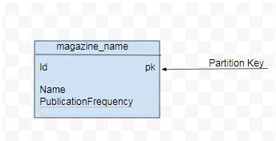

# 카산드라
## 데이터 모델링
* 카산드라의 데이터 모델은 쿼리를 기반으로 최적화합니다. 
* 데이터 모델링이란 엔티티와 그 관계를 식별하는 프로세스입니다. 
* 카산드라 안에서 데이터 모델링은 쿼리를 주도로 진행됩니다. 
  * 쿼리를 기반으로 테이블의 구조와 구성을 결정 해야 합니다. 
* 읽기를 빠르게 수행하려면 쿼리에 관련된 엔티티가 동일한 테이블에 있어야 한다.
* 단일 엔티티가 여러 테이블에 포함될 수 있습니다. 
## 쿼리 주도 모델링
* 카산드라는 조인이 지원되지 않으므로 모든 필수 필드들은 단일 테이블안에서 그룹화되어야 합니다. 
* 데이터는 비정규화를 통해서 여러 테이블에 복제됩니다. 
* 데이터 중복과 높은 쓰기 처리량으로 높은 읽기 성능을 달성하는데 사용됩니다. 

## 목표 
* primary 키와 파티션 키를 선택하는 것이 클러스터 전체에 데이터를 균등하게 분산하기 위해서 중요합니다. 
* 쿼리를 위해서 읽어야 하는 파티션의 수를 최소한으로 유지하는 것이 중요합니다. 
* 왜냐하면 서로 다른 파티션이 서로 다른 노드에 있을 수도 있고 coordinator가 각 노드에게 요청을 보내야 하기 때문에 오버헤드가 발생할 수 있습니다. 
* 쿼리에 포함된 다른 파티션이 동일한 노드에 있더라도 더 적은 파티션이 더효율적입니다. 
## 파티션
* 카산드라는 노드 클러스터에 데이터를 저장하는 분산 데이터 베이스입니다. 
* 파티션 키는 노드간의 데이터를 파티션하는 데 사용됩니다. 
  * (파티션의 단어의 뜻은 분할,칸막이를 뜻합니다.)
* 카산드라는 데이터 분산을 위해서 일관된 해싱을 사용하여 스토리지 노드에 데이터를 분할합니다. 
  * 해싱은 키가 주어지면 해시 함수를 통해서 해시 값을 생성해서 데이터를 매핑하는데 사용됩니다. 
* 파티션 키는 **primary key의 첫번째 필드**로부터 생성합니다. 
* 파티션 키를 사용해서 해시 테이블로 분할 된 데이터를 빠르게 조회를 제공합니다. 
* 쿼리에 **파티션이 적게 사용될수록** 응답시간이 빨라집니다. 
* 예제 파티셔닝 
  * id가 primary 키의 유일한 필드인 T 테이블은 생각해보면 
```sql
CREATE TABLE t (
   id int,
   k int,
   v text,
   PRIMARY KEY (id)
);
```
* 클러스터 노드들의 사이에 데이터 분배를 위한 파티션 키는 primary key id로 부터 생성됩니다. 
* 복합키를 만들기 위해서 두개의 필드로 구성된 primary key를 가진 변형 t table을 생각해보면 
```sql
CREATE TABLE t (
   id int,
   c text,
   k int,
   v text,
   PRIMARY KEY (id,c)
);
```
* 복합 기본키가 있는 테이블 t의 경우 첫 번째 필드 ID가 파티션 키를 생성하는 사용됩니다. 
* 두번째 필드는 파티션 내에서 정렬하는데 사용되는 클러스터링 키입니다. 
* 클러스터링 키를 사용하여 데이터를 정렬하면 인접한 데이터를 보타 효율적으로 검색할 수 있습니다.
* 일반적으로 primary 키의 첫 필드는 파티션 키를 생성하기 위해서 해시되고 나머지 필드는 데이터 정렬에 하는데 사용되는 클러스터링 키입니다.
* 데이터를 분할하면 읽기 및 쓰기의 효율성이 향상됩니다. 
* 기본 키 필드가 아닌 다른 필드는 쿼리 성능을 더욱 향상 시키기 위해서 별로로 인덱싱 될 수 있습니다. 
* primary key의 첫번째 구성 요소로 그룹화 되어 있는 경우 여러개의 필드로 파티션 키가 생성 될 수 있습니다.
* 또 다르게 변형된 테이블 t는 괄호를 사용해서 primary 키의 첫번째 구성요소가 두개의 필드로 구성되어 됩니다.
```sql
CREATE TABLE t (
   id1 int,
   id2 int,
   c1 text,
   c2 text
   k int,
   v text,
   PRIMARY KEY ((id1,id2),c1,c2)
);
```
* 위의 t 테이블은 id1, id2를 사용해서 파티션 키를 생성하고 나머지 필드인 c1, c2는 파티션 내에서 정렬하는데 사용되는 클러스터링 키입니다. 

## 관계형 데이터 모드와 비교 
* 관계형 데이터베이스는 다른 테이블과의 관계가 있는 테이블에 외래 키를 사용해서 데이터를 저장합니다. 
* 데이터 모델링에 대한 관계형 데이터 베이스 접근방식은 테이블 중심임
* 쿼리들은 관계를 가지는 여러 테이블의 데이터를 얻기 위해서 join을 사용해야 합니다. 
* 카산드라는 외래 키 또는 관계형 무결성 개념이 없습니다.
  * (참조 무결성 : 참조 관계의 두 테이블의 데이터가 항상 일관된 값을 갖도록 유지하는 것을 말합니다.  )
* 카산드라의 데이터 모델은 효율적인 쿼리 설계를 기반으로 구성됩니다. 
* 쿼리들은 여러 테이블을 포함하지 않습니다. 
* 관계형 데이터 베이스는 중복을 회피하기 위해서 데이터를 정규화 합니다. 
* 반대로 카산드라는 쿼리 중신 데이터 모델을 위해서 여러 테이블의 데이터를 복제하여 비정규화 합니다. 
* 만약에 카산드라 데이터 모델이 서로 다른 엔티티간의 관계의 복잡성을 완전히 통합하지 못한다면 애플리케이션 클라이언트 측 조인을 사용할 수있습니다. 
  * client-side joins란 무엇인가?
    * 데이터를 얻기 위해서 여러번의 쿼리를 해서 조합해야한다는 뜻입니다.
    * 카산드라는 일반적으로 하나의 쿼리가 하나 테이블에 매핑되어야 합니다.
    * 참조 : https://community.datastax.com/questions/5245/client-joins.html
## 데이터 모델링 예제
* 예를 들면 magazine 데이터 셋트는 magazine id, magazine name, publication frequency로 구성됩니다. 
* magazine 데이터에 대한 기본 쿼리(Q1)는 발행빈도와 이름을 나열하는 것입니다. 
* 모든 테이터 속성이 Q1에 필요한 것은 아니므로 데이터 모델은 id, name, frequency로만 구성됩니다. 
* Q1 쿼리를 위한 데이터 모델.
* 
```sql
CREATE TABLE magazine_name (id int PRIMARY KEY, name text, publicationFrequency text)
```

* 다른 쿼리(Q2)는 publisher별로 모든 잡지의 이름을 나열하는 것입니다. 
* Q2의 데이터 모델은 파티션 키를 위해서 publisher 속성이 추가되도록 구성됩니다. 
* id는 파티션 안에서 정렬하기 위한 클러스터 키가 됩니다. 
* 
```sql
CREATE TABLE magazine_publisher (publisher text,id int,name text, publicationFrequency text,
PRIMARY KEY (publisher, id)) WITH CLUSTERING ORDER BY (id DESC)
```

## 데이터 모델 분석 
* 데이터 모델은 storage, 용량, 중복와 일관성을 기반으로 분석 및 최적화 해야 하는 개념적 모델입니다. 
* 분석의 결과로 데이터 모델을 수정해야 할 수 도 있습니다. 
* 데이터 모델 분석에 사용되는 고려 사항 및 제한 사항은 다음과 같습니다. 
  * 파티션 사이즈 
  * 데이터 중복
  * 디스크 공간
  * Lightweight Transactions

## 참조 사이트
* https://cassandra.apache.org/doc/latest/data_modeling/intro.html