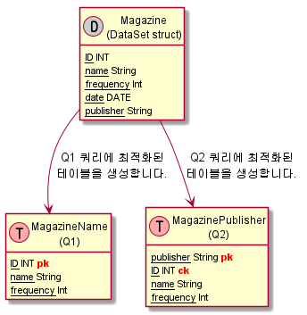

## 카산드라 데이터 모델링 특징
* 쿼리 기반 데이터 모델링 
  * ex) 어떤 쿼리가 필요하면 그것에 최적화된 테이블을 생성
* 읽기를 빠르게 하기 위해서 비정규화를 통한 데이터를 중복적재 합니다.
* 카산드라는 조인을 지원하지 않으므로 필요한 데이터는 한 테이블에 구성되어야 합니다. 

## 파티션(partition)
* 카산드라는 노드 클러스터에 데이터를 저장하는 분산 데이터 베이스입니다.
* 파티션 키를 해싱 처리하여 스토리지 노드에 데이터를 분산시킵니다. 
* 파티션 키를 통해서 해시 테이블로 분산된 데이터를 빠르게 접근 할 수 있습니다. 
* 쿼리를 작성할 때 파티션이 적게 사용 될 수록 응답시간이 빨라집니다. 

## 데이터 모델링의 목표
* primary key와 partition key를 선택하는 것은 클러스터에 데이터를 균등하게 분산하기 위해서 중요합니다.
* 쿼리를 위해서 읽어야 하는 파티션의 수를 최소한으로 유지하는 것이 중요합니다.
  * 이유 
    * 서로 다른 파티션은 다른 노드에 있을 수 있고 만약 그렇다면 각 노드들에게 Request 해야 하는 비용이 발생 
    * 파티션이 동일한 노드에 있더라도 더 적은 파티션이 효율적임

## 관계형 데이터 모델과 비교 
* 카산드라는 join을 지원하지 않습니다.
* 카산드라 데이터 중복에 대해서 비정규화를 통해 중복적으로 데이터 적재합니다.
* 카산드라는 쿼리 기반으로 테이터 모델을 설계합니다.
* 만약에 카산드라가 엔티티간의 복잡성을 완전히 통합하지 못한다면 Client Side Join을 수행할 수있습니다.
  * Client Side Join란 간단히 클라이언트에서 여러개의 쿼리를 요청해서 조합하는 것을 말합니다. 
  * 이런 상황이라면 디자인에 대한 재설계가 중요 할듯

||관계형 데이터|카산드라|
|:--:|:--:|:--:|
|Join|사용가능|사용불가|
|무결성|있음|없음|
|디자인 설계|테이블 관계 기반|쿼리 기반 |
|데이터중복|정규화|비정규화|

## 데이터 모델링 검토사항
* 

## 파티션 키(partition key) 및 클러스터링 키(clustering key) 생성 방식
* partition key는 primary key의 첫번째 필드로부터 생성됩니다. 
* primary key의 나머지 필드는 clustering키가 됩니다. 
```sql
CREATE TABLE t (
   id int,
   c text,
   k int,
   v text,
   PRIMARY KEY (id, c)
);
```
* 예를 들면 위의 예제 테이블의 경우 id 필드는 partition key가 되고 c 필드는 clustering key가 됩니다. 
* 만약에 PRIMARY KEY(id) 였다면  id 필드는 partition key이고 clustering key는 없습니다.
  * partition key만 필수 조건입니다. 
* 앞서 설명한 것과 같이 partition key의 역활은 해싱 처리를 통한 클러스터의 노드들에 데이터를 분산시키는데 사용 됩니다.
* clustering key는 파티션안에서 데이터를 정렬 시키는데 사용되는 값입니다. 
```sql
CREATE TABLE t2 (
   id1 int,
   id2 int,
   c1 text,
   c2 text
   k int,
   v text,
   PRIMARY KEY ((id1,id2),c1,c2)
);
```
* 위의 예제 테이블 처럼 partition key도 복합 키(id1, id2 필드)로 구성될 수 있습니다. 
* id1, id2 필드는 partition key가 되고 c1, c2 필드는 clustering key가 됩니다. 

## 데이터 모델링 예제


## 참조 
* https://cassandra.apache.org/doc/latest/data_modeling/intro.html