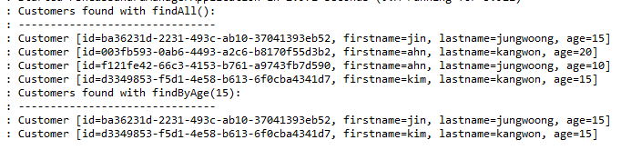
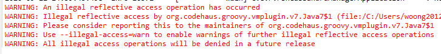

## Docker를 통해서 설치하기
* Docker Compose를 구성하면 여러개의 노드들을 편하게 구성할 수 있다.
* 테스트는 싱글 노드로 구성하기 때문에 docker로 구성
* 설치 예제
```bash
docker run --name woong-cassandra -d -p 9042:9042 -p 9160:9160 cassandra:latest
```

## CQL를 통해서 카산드라에 테이블 추가 
* docker 이미지로 접속합니다. 
```bash
docker exec -it woong-cassandra /bin/bash
```
* **cqlsh** 명령을 수행합니다.
* 키스페이스를 생성 및 테이블을 생성합니다. 
```sql
-- demo 키스페이스 생성 
CREATE KEYSPACE demo WITH REPLICATION = { 'class' : 'NetworkTopologyStrategy', 'datacenter1' : 3};
-- 생성된 키스페이스 확인 
select * from system_schema.keyspaces;
-- Customer 테이블 생성 
CREATE TABLE demo.Customer(id UUID, firstname text, lastname text, age int, PRIMARY KEY(id));
-- Customer 테이블 확인
select * from demo.Custemer;

-- Customer 테이블 삭제
DROP TABLE IF EXISTS demo.Custemer
```
## Spring Boot 설정
### application.properties 설정하기 
```java
// 연결할 키스페이스 이름
spring.data.cassandra.keyspace-name=demo
// 연결할 카산드라 접속 정보
// single 노드로 구성된 경우 데이터 센터를 datacenter1로 셋팅합니다.
spring.data.cassandra.contact-points=localhost:9042
// 데이터센터?!
spring.data.cassandra.local-datacenter=datacenter1
```

### 필요한 Dependency 
* Spring Data for Apache Cassandra
```xml
<dependency>
    <groupId>org.springframework.boot</groupId>
    <artifactId>spring-boot-starter-data-cassandra</artifactId>
</dependency>
```

## 예제 소스 코드
### Customer 클래스 예제
```java
package "패키지명"

import java.util.UUID;

import org.springframework.data.cassandra.core.mapping.PrimaryKey;
import org.springframework.data.cassandra.core.mapping.Table;

@Table
class Customer {
    // 키만 설정하면 이클립스에서 자동으로 Bean의 소스를 Generate 해준다.
	@PrimaryKey
	private UUID id;
	private String firstname;
	private String lastname;
	private int age;
	
	Customer() {
	}
	
	public Customer(UUID id, String firstname, String lastname, int age) {
		super();
		this.id = id;
		this.firstname = firstname;
		this.lastname = lastname;
		this.age = age;
	}

	public UUID getId() {
		return id;
	}
	public void setId(UUID id) {
		this.id = id;
	}
	public String getFirstname() {
		return firstname;
	}

	public void setFirstname(String firstname) {
		this.firstname = firstname;
	}
	public String getLastname() {
		return lastname;
	}
	public void setLastname(String lastname) {
		this.lastname = lastname;
	}
	public int getAge() {
		return age;
	}
	public void setAge(int age) {
		this.age = age;
	}
	
	@Override
	public String toString() {
		return "Customer [id=" + id + ", firstname=" + firstname + ", lastname=" + lastname + ", age=" + age + "]";
	}
}
```
### CustomerRepository 클래스 예제
```java
package "패키지명"

import java.util.List;
import java.util.UUID;

import org.springframework.data.cassandra.repository.AllowFiltering;
import org.springframework.data.cassandra.repository.CassandraRepository;

// 카산드라 Repository 설정의 주의점
// 키로 설정하지 않은 컬럼을 검색하려고 하면 에러가 발생함
public interface CustomerRepository extends CassandraRepository<Customer, UUID>{
	@AllowFiltering
	List<Customer> findByAge(int Age);
}
```

### Application 클래스 예제
```java
@SpringBootApplication
@EnableAutoConfiguration
public class PbnCassandraManagerApplication {
	
	private static final Logger log = LoggerFactory.getLogger(PbnCassandraManagerApplication.class);
	@Autowired
	private com.example.PBNFlowManager.CustomerRepository customerRepository;


	public static void main(String[] args) {
		SpringApplication.run(PbnCassandraManagerApplication.class, args);
	}
	
    // Command로 테스트 로직 구현
	@Bean
	public CommandLineRunner demo(com.example.PBNFlowManager.CustomerRepository customerRepository) {
		return (args)->{
			customerRepository.deleteAll();
			customerRepository.save(new Customer(UUID.randomUUID(), "ahn", "jungwoong", 10));
			customerRepository.save(new Customer(UUID.randomUUID(), "kim", "kangwon", 15));
			customerRepository.save(new Customer(UUID.randomUUID(), "jin", "jungwoong", 15));
			customerRepository.save(new Customer(UUID.randomUUID(), "ahn", "kangwon", 20));
			
			// fetch all customers
			log.info("Customers found with findAll():");
			log.info("-------------------------------");
			
			for ( var customer : customerRepository.findAll()) {
				log.info(customer.toString());
			}
			
			log.info("Customers found with findByAge(15):");
			log.info("-------------------------------");
			
			for ( var customer : customerRepository.findByAge(15)) {
				log.info(customer.toString());
			}
		};
	}

}
```
### 작업 수행결과 
* 


## 작업시 발생되는 Warning

* 원인 
  * Java 11과 함께 Groovy 2.x를 사용하면 발생 Groovy3에서 수정됨
* 해결방안
  * https://backstage.forgerock.com/knowledge/kb/article/a15048811
  * Grooby를 3.x을 사용하던지
  * warning을 Whitelist처리
  * JDK를 1.8로 다운그레이드

## TO DO 리스트
* REST API와 연동해서 사용하는 방법 

## Spring IO 카산드라 관련 문서 정보
* https://docs.spring.io/spring-boot/docs/2.3.3.RELEASE/reference/htmlsingle/#boot-features-cassandra
* https://github.com/spring-projects/spring-data-cassandra
* https://bezkoder.com/spring-boot-cassandra-crud/
* http://wonwoo.ml/index.php/post/1866