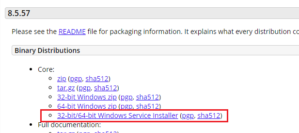
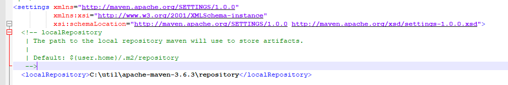

# Spring5를 윈도우에서 설정하기 
## 구성파일
* IDE - Eclipse IDE for jave EE Developers
* Java - AdoptOpenJDK\jdk-14.0.2.12-hotspot\
* Tomcat - 8.5
* Maven - 3.6.3
  
## 설치하기 
### 이클립스 인코딩 설정
이클립스의 [window] -> [Perferences] 에서 "encoding" 검색후 모든 내용을 "UTF-8"

### JAVA 설치하기
* adoptopenjdk : https://adoptopenjdk.net/?variant=openjdk14&jvmVariant=hotspot
* oracle jdk : https://www.oracle.com/java/technologies/javase-jdk14-downloads.html

### 톰캣 설치 하기
다운로드 사이트 :  https://tomcat.apache.org/download-80.cgi

 다운 받아서 설치합니다.

### 이클립스에 톰캣 환경 설정
이클립스의 [window] -> [Perferences] 에서 "server" 검색합니다. 
설치한 톰캣 설정을 추가합니다.

### 이클립스 git ignore 설정

### Maven 설치
1. 다운로드 사이트 : http://maven.apache.org/

2. 다운 로드한 zip파일 압축해제
3. 해제한 폴더에 **"repository"** 폴더 생성
4. \conf\settings.xml 의 <LocalRepository> 셋팅

### 이클립스와 Maven 연동
이클립스의 [window] -> [Perferences] 에서 "maven" 검색합니다. 

maven 설치한 경로 user setting에 추가 

## 참조 사이트
https://usang0810.tistory.com/26