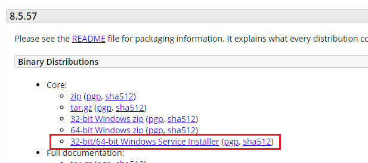
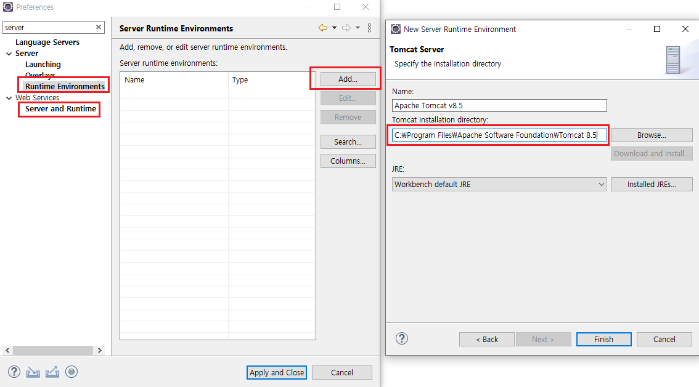
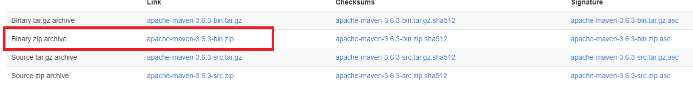
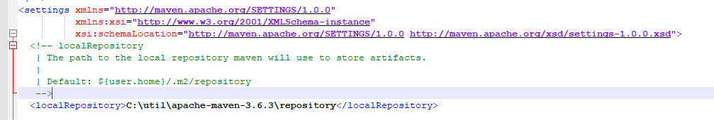
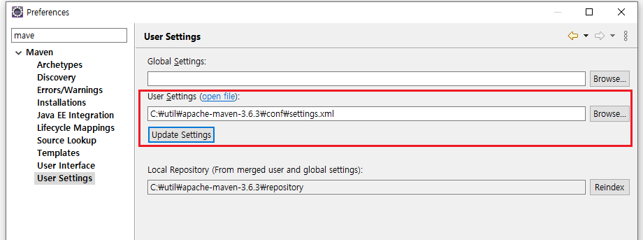
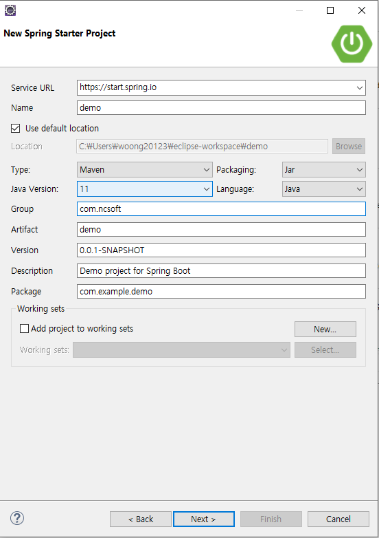
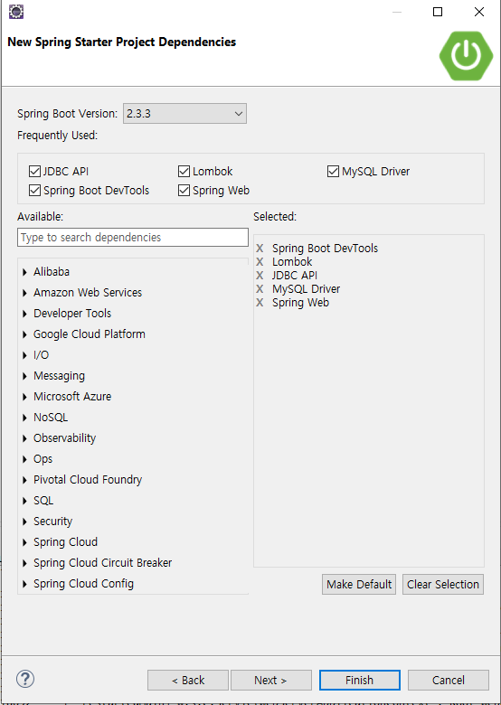

# Spring Boot를 윈도우에서 설정하기 
## 구성파일
* IDE - Eclipse IDE for jave EE Developers
* Java - OpenJDK\jdk-11.0.8.10\
  * https://github.com/ojdkbuild/ojdkbuild
* Tomcat - 8.5
* Maven - 3.6.3

## 설치하기 
### 이클립스 인코딩 설정
이클립스의 [window] -> [Perferences] 에서 "encoding" 검색후 모든 내용을 "UTF-8"

### JAVA jdk 설치하기
* https://github.com/ojdkbuild/ojdkbuild

### 톰캣 설치 하기
다운로드 사이트 :  https://tomcat.apache.org/download-80.cgi

 다운 받아서 설치합니다.

### 이클립스에 톰캣 환경 설정
이클립스의 [window] -> [Perferences] 에서 "server" 검색합니다. 
설치한 톰캣 설정을 추가합니다.

### 이클립스 git ignore 설정

### Maven 설치
1. 다운로드 사이트 : http://maven.apache.org/

2. 다운 로드한 zip파일 압축해제
3. 해제한 폴더에 **"repository"** 폴더 생성
4. \conf\settings.xml 의 <LocalRepository> 셋팅

### 이클립스와 Maven 연동
이클립스의 [window] -> [Perferences] 에서 "maven" 검색합니다. 

maven 설치한 경로 user setting에 추가 

### STS(Spring Tool Suite) 설치
Spring 프레임 워크를 사용하기 위한 툴
이클립스의 [Help] - [Eclipse MarketPlace] 에서 "STS4"를 검색해서 설치

### 스프링 프로젝트 생성하기 
[New] - [Other] - Spring 검색 - 프로젝트 이름 추가 및 생성

 라이브러리 설정하기 

### factory method 'datasource' 에러 발생시 
src/resources/application.properties에 데이터 추가 필요 
* spring.datasource.driver-class-name=com.mysql.cj.jdbc.Driver
* spring.datasource.url=jdbc:mysql://localhost:3306/rolb
* spring.datasource.username=root
* spring.datasource.password=root123
* spring.datasource.initialize=true
* spring.jpa.hibernate.ddl-auto=update
* spring.jpa.show-sql=true