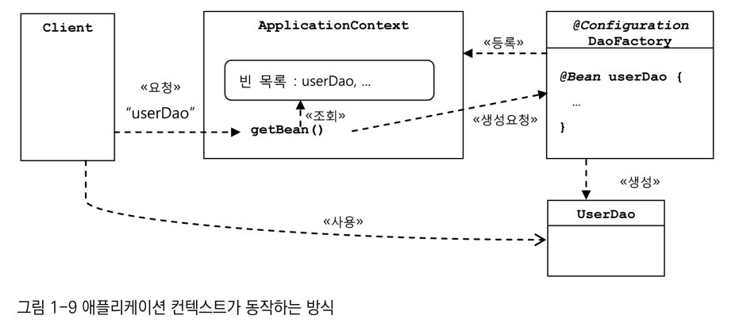
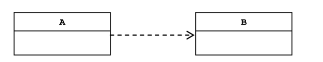
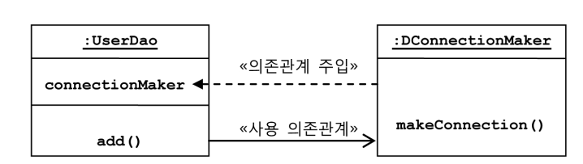
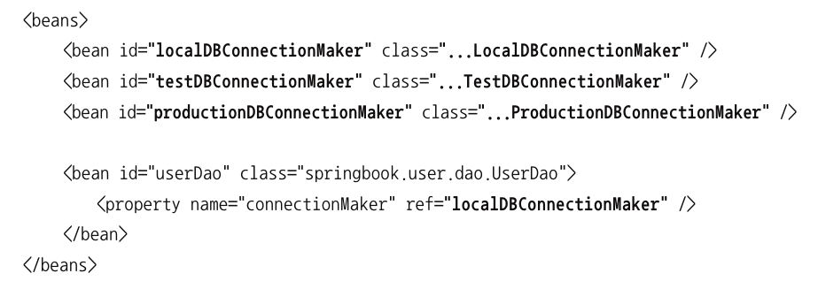

# 문서정리

### 간단한 DAO만들기
* User 클래스 실습 
  * 자바빈을 지원하는 형태의 클래스를 생성합니다. 

* DAO의 분리
  * 분리와 확장을 고려한 설계가 존재 해야 한다.
  * 변화는 일반적으로 한가지 관심에 대해서 발생합니다. 
    * 예를 들어 DB 접속용 암호를 변경한다면?
    * 트랜잭션 기숭을 다른것으로 변경된다면?
  * 이러한 한가지의 관심을 한 군데로 집중한다면 관리가 편리해질 것이다. 
* 예제 UserDao의 관심사항
  1. DB와의 연결을 위한 커네션을 어떻게 가져올것인가?
     * DB는 어떤것을 사용하고 드라이버는 어떤 것을 사용할 것인지 등등
  2. DB에 보낼 SQL 문장을 담을 Statement를 만들고 실행 시키는 것
     1. SQL 문자에 전달받은 변수를 바인딩 방법
  3. 작업이 완료된 후에 리소스를 시스템에 반환하는 작업

* 개선 방법
  * 리펙토링 방법중 하나인 메서드 추출 기법으로 중복되는 코드를 제거합니다.

## 원칙과 패턴
### 객체 지향 설계 원칙(SOLID)
* SRP(The Single Responsibility Principle) : 단일 책임 원칙
* OCP(OCP Open-Closed Principle) : 개발 폐쇄 원칙
  * 클래스나 모듈은 확장에는 열려 있어야 하고 변경에는 닫혀 있어야한다. 
    * 예를 들어 UserDao는 DB 연결 방법과 같은 기능을 확장하는데는 열려 있어야 한다.
    * UserDao의 영향을 주지 않고 기능 확장이 되어야 하며 핵심 기능에 영향을 주지 않습니다.
* LSP(The Liskov Substitution Principle) : 리스코브 치환 원칙
* ISP(The Interface Segregation Principle) : 인터페이스 분리 원칙
* DIP(The Dependency Inversion Principle) : 의존 관계 역전 원칙
* http://butunclebob.com/ArticleS.UncleBob.PrinciplesOfOod
* 도서 
  * Java 프로그래머를 위한 UML 실전에서는 이것만 쓴다. : 밥 마틴
  * 소프트 웨어 개발의 지혜 : 원칙, 디자인 패턴, 실천 방법 : 밥 마팅
### 높은 응집도와 낮은 결합도
#### 높은 응집도
> 높은 응집도란 변화가 일어 날 때 모듈에서 변하는 부분이 크다는 것을 뜻하며
책임과 관심사를 기준으로 오브젝트나 모듈이 구현되어 있는 것을 뜻합니다.  

#### 낮은 결합도
> 낮은 결합도는 책임과 관심사가 다른 오브젝트와 모듈은 느슨하게 연결된 형태를 유지하는 것을 뜻합니다
결합도란 "하나의 오브젝트가 변경될 때 관계를 맺고 있는 다른 오브젝트에게 변화를 요구하는 정도"입니다. 
  
예제의 DAO 객체는 DB 연결에 대한 기능을 DB connection을 인터페이스 클래스로 분리하고 생성책임을 DAO 외부에서 결정하도록 구현해서 낮은 결합도를 지원합니다. 

DAO 객체는 사용자의 데이터를 처리하는 기능을 지원하고 ConnectionMake는 자신의 기능에 충실하도록 지원합니다.  
  
## 제어의 역전(IoC)
### 팩토리
> 객체의 생성 방법을 결정하는 오브젝트를 팩토리라고 부릅니다. 
팩토리를 사용하면 컴포넌트 객체들과 설계 관점의 객체들 구분할 수 있습니다. 
### 제어권의 이전을 통한 제어관계 역전
#### 일반적인 프로그램의 흐름
1. main() 메소드에서 프로그램 시작
2. 사용할 오브젝트 결정하고 생성합니다. 
3. 오브젝트의 메소드를 호출해서 프로그램의 흐름을 제어합니다.  
> 즉 사용자 입장에서 모든 종류의 작업을 제어합니다. 

#### 제어의 역전이란?
> IoC에서는 오브젝트가 자신이 사용할 오브젝트를 스스로 선택하지도 생성하지도 않습니다.
>  자신이 어떻게 만들어지고 어떠헥 사용되는지 알 수 없으며 모든 제어 권한을 자신이 아닌 다른 대상에게 위임합니다. 

일반적인 Java 프로그램은 main() 메서드를 통해서 오브젝트가 생성되고 실행됩니다. 
하지만 서블릿을 개발해서 서버에 배포 할 수는 있지만 그 실행을 개발자가 직접 제어 할 수 있는 방법이 없기 때문에 서블릿에서는 제어 권한을 가진 컨테이너가 적절한 시점에 서블릿 클래스 오브젝트를 만들고 그 안의 메소드르 호출합니다. 

## 스프링의 IOC
스프링은  IoC를 모든 기능의 기초가 되는 기반기술로 삼고 있습니다. 
스프링의 핵심을 담당하는 건 바로 빈 팩토리 또는 애플리케이션 컨텍스트라고 불립니다. 
### 애플리케이션 컨텍스트 와 설정 정보
#### 빈(bean)
> 스프링에서는 스프링이 제어권을 가지고 직접 만들고 관계를 부여하는 오브젝트를 "빈" 이라고 부릅니다. 
> 스프링은 빈에 IoC를 적용합니다. 

#### 빈 팩토리
> 빈의 생성과 관계 설정의 제어를 담당하는 IoC 오브젝트를 말합니다. 

#### 어플리케이션 컨텍스트 
> Ioc 방식에 따라 만들어진 일봉의 빈 팩토리를 말하며 애플리케이션 전반에 걸처 모든 구성 요소의 제어 작업을 담당하는 IoC엔진의 의미로 쓰임
> 별도의 정보를 참고해서 빈의 생성, 관계 설정등의 제어 작업을 촐괄합니다. 

#### DaoFactory를 사용하는 애플리케이션 컨텍스트
@Configuration, @Bean 애노테이션을 추가해서 설정할 수 있습니다.

애노테이션 설정 예제
```java
import org.springframework.context.annotation.Bean;
import org.springframework.context.annotation.Configuration;

@Configuration
public class DaoFactory {
	@Bean
	public UserDao userDao() {
		UserDao dao = new UserDao(connectionMaker());
		return dao;
	}

	@Bean
	public ConnectionMaker connectionMaker() {
		ConnectionMaker connectionMaker = new DConnectionMaker();
		return connectionMaker;
	}
}
```
애플리케이션 컨텍스트 사용 예제
```java
    AnnotationConfigApplicationContext context = new AnnotationConfigApplicationContext(DaoFactory.class);
    // getBean(함수명, 클래스) 함수명을 파라미터로 가지는 이유는 다양한 구성 정보를 가질 수 있는 장점이 있습니다.
    UserDao dao = context.getBean("userDao", UserDao.class);
```
#### 어플리케이션 컨텍스트 동작 방식 

> 어플리케이션 컨텍스트에 DaoFactory를 어떻게 사용되고 있는지를 그림으로 표현해줍니다. 
> 어플리케이션 컨텍스트는 등록된 설정정보에서 @Bean이 붙은 메소드를 가져와서
Bean 목록을 만듭니다. 

#### 어플리케이션 컨텍스트 장점
* 클라이언트는 구체적인 팩토리 클래스를 알 필요가 없습니다. 
  * 팩토리 오브젝트가 많아져도 이를 알거나 직접사용할 필요가 없습니다. 
  * 일관된 방식으로 원하는 오브젝트를 제공합니다.
* 종합 IoC 서비스를 제공해줍니다. 
  * 오브젝트 생성, 관계 설정, 오브젝트가 만들어지는 방식, 시점, 전략을 다르게 가져갈 수 있습니다. 
  * 자동생성, 후처리, 정보의 조합, 설정등 다양한 기능을 제공합니다 .
* Bean을 검색하는 다양한 방법을 제공합니다. 
  * 이름을 통해서 검색할 수 있고 타입이나 특별한 애노테이션 설정으로 검색이 가능합니다. 

## 싱글톤 레지스트리와 오브젝트 스코프
### 애플리케이션 컨텍스트에서 빈오브젝트의 생성 
> 기존의 Factory로 객체를 생성하면 매번 다른 객체를 리턴함
애플리케이션 컨텍스트로 getBean()을 통해서 오브젝트를 생성하면 같은 오브젝트를 리턴합니다.<br> 
이와 같은 형식으로 알 수 있는 것은 애플리케이션 컨텍스트는 싱글톤 레지스트리입니다.<br>
별다른 설정하지 않으면 등록된 모든 빈 오브젝트를 모두 싱글톤으로 생성합니다.<br>
### 빈을 싱글톤으로 만드는 이유
> 스프링이 주로 적용되는 대상이 자바 엔터프라이즈 기술이 사용하는 서버환경이기 때문입니다.<br>
> 서블릿은 대부분 멀티 스레드 환경에서 싱글톤을 동작합니다. 
> 서블릿 클래스당 하나의 오브젝트만 만들어두고 사용자 요청을 담당하는 여러 스레드에서 하나의 오브젝트를 공유해서 동시에 사용합니다. 

### 싱글톤 레지스트리
싱글톤 패턴은 상속이나 전역 접근 같은 많은 제약사항을 가집니다. 
그것을 개선하기 위해서 일반적인 오브젝트를 등록해서 마치 싱글톤 처럼 관리해즈는 역활을 싱글톤 레지스트리를 통해서 지원합니다. 

### 싱글톤과 오브젝트의 상태
싱글톤이 멀티스레드 환경에서 서비스 형태의 오브젝트로 사용되는 경우 
상태정보를 내부에 가지지 않은 무상태 stateless 방식으로 만들어져야 합니다.<br>
읽기 전용의 값이라면 초기화시점에 저장해놓고 공유하는 것은 문제 없음<br>
다른 변수들을 멀티 스레드에 의해서 덮여 씌여질 수 있습니다.<br>
stateless 클래스는 어떻게 만들 수 있을까? 리소스를 어떻게 다뤄야 할까?<br>
파라미터와 로컬변수, 리턴값을 통해서 구현 해야 합니다. 독립적인 공간<br>
#### **일반적인 구현**
```java
public class UserDao {
  /// 읽기 전용 데이터는 문제가 되지 않음
  private ConnectionMaker connectionMaker;

  /// 매번 새로운 값으로 변경되는 정보라서 
  /// 멀티 스레드 환경에서 문제가 됨
  private Connection c;
  private User user;

	public User get(String id) throws ClassNotFoundException, SQLException {
		this.c = this.connectionMaker.makeConnection();
		...
		this.user.setId(rs.getString("id"));
		this.user.setName(rs.getString("name"));
		this.user.setPassword(rs.getString("password"));
    ...
		return this.user;
	}
}
```
#### **stateless로 구현**
```java
public class UserDao {
	private ConnectionMaker connectionMaker;

	public User get(String id) throws ClassNotFoundException, SQLException {
		Connection c = this.connectionMaker.makeConnection();
		...
		User user = new User();
		user.setId(rs.getString("id"));
		user.setName(rs.getString("name"));
		user.setPassword(rs.getString("password"));
    ...
		return user;
	}
}
```

### 스프링 Bean 스코프
빈의 스코프란 빈이 생성되고 존재하 적용되는 범위를 말합니다.<br>
스프링에서 만들어지는 대부분의 빈은 싱글톤 스코프를 가진다.<br>
실들톤 외 스코프를 가질 수 잇는데 대표적으로 프로토타입 스코프가 있습니다. 

## 의존 관계 주입(DI)
### 의존 관계

그림에서는 A가 B에 의존하고 있다는 것을 나타냅니다. 
의존하고 있다는 뜻은 의존 대상인 B가 변하면 A에 영향을 미친다는 뜻입니다.
대표적인 예는 A가 B를 사용하는 경우 B에 정의된 메서드를 호출해서 사용 합니다. 
예제에서는 UserDao가 ConnectionMaker에 의존하지만 인터페이스이기 때문에
내부 구현 변경에 대해서 영향을 받지 않습니다.<br>
이렇게 인터페이스를 기반으로 의존관계가 적용되면 결합도가 낮은상태를 유지합니다. 

### 의존 관계 주입이란?
보통 의존관계는 설계 관점에서 이루어지며 어떤 오브젝트가 사용될지 알 수 없습니다. 
실제 프로그램이 수행되는 런타임에서 의존관께를 맺는 대상을 의존 오브젝트라고 부릅니다.<br>
의존 관계 주입은 의존 오브젝트와 그것을 사용할 주체 (ex 클라이언트)와 연결해주는 작업을 말합니다. 
의존 관계 주입 조건
* 클래스 모델이나 코드에는 런타임 시점의 의존관계가 드러나지 않습니다.(인터페이스 사용)
* 런타임 시점의 의존관계는 컨테이너나 팩토리 같은 제3의 존재가 결정
* 의존관계는 사용할 오브젝트에 대한 레퍼런스를 외부에서 제공해줌으로 만들어집니다. 
예제


## xml을 이용한 설정
자바 클래스를 이용하는 것외에도 xml을 통해서 DI 설정 정보를 만들 수 있습니다. 
### xml에서 사용될때 애트리뷰트의 변환

||자바코드|XML설정정보|
|:---:|:---:|:---:|
|빈의 설정파일|@Configuration|\<beans>|
|빈의 이름|@Bean methodName()|\<bean id="methodName" |
|빈의 클래스|return new BeanClass()|class="a.b.c...BeanClass"> |

### @Bean 메소드를 통해서 얻을 수 있는 DI 정보
* 빈의 이름
  * 메서드의 이름
  * getBean()에서 검색용으로 사용됩니다. 
* 빈의 클래스
  * 클래스 명칭 
* 빈의 의존 오브젝트
  * 빈의 생성자나 수정 메소드를 통해서 의존하는 오브젝트
  * 없을 수도 있고 하나 이상일 수도 있습니다.

#### 자바 코드를 통한 Bean 셋팅
```java
@Configuration
public class DaoFactory {
  @Bean
  public UserDao userDao() {
    UserDao dao = new UserDao();
    dao.setConnectionMaker(connectionMaker());
    return dao;
  }

  @Bean
  public ConnectionMaker connectionMaker() {
    return new DConnectionMaker();
  }
}
```
#### Xml를 통한 Bean 셋팅
```xml
<?xml version="1.0" encoding="UTF-8"?>
<beans xmlns="http://www.springframework.org/schema/beans"
  xmls:xsi="http://www.w3.org/2001/XMLSchema-instance"
  xsi:schemaLocation="http://www.springframework.org/schema/beans
      http://www.springframework.org/schema/beans/spring-beans-3.0.xsd">
  <bean id="dataSource", 
    class="org.springframework.jdbc.datasource.SimpleDriverDataSource">
    <property name="driverClass" value="com.mysql.jdbc.Driver" />
    <property name="url" value="jdbc:mysql://localhost/springbook" />
    <property name="username" value="spring" />
    <property name="password" value="book" />
  <bean id="userDao", class="springbook...UserDao">
    <property name="connectionMaker", ref="connectionMaker" />
  </bean>
</beans>
```

#### Xml에서 Bean 사용 예제
참조된 Bean 변경시 


같은 인터페이스 타입의 여러개로 정의한경우



## 용어 정리
* DAO 
  * Data Access Object라고 합니다.
  * DB를 사용해서 데이터를 조회하거나 조작하는 기능을 전담하도록 만든 오브젝트
* 자바빈
  * 자바빈(JavaBean)은 원래 비주얼 툴에서 조작 가능한 컴포넌트를 말합니다. 
  * 스프링이 IoC 방식으로 관리하는 오브젝트를 말합니다. 
  * 자바가 웹 기반으로 바뀌면서 두가지 관례로 만들어진 오브젝트를 가르킵니다. 
    * 디폴스 생성자 
      * 자바빈은 파라미터가 없는 디폴트 생성자를 가져야 합니다. 
      * 툴이나 프레임 워크에서는 리플렉션을 이용해서 오브젝트를 생성합니다. 
    * 프로퍼티
      * 자바 빈이 노출하는 이름을 가진 속성을 프로퍼티라고 합니다 
      * 프로퍼티는 set함수와 get함수를 지원해야합니다. 
* Bean 팩토리
  * 스프링의 IoC를 담당하는 핵심 컨테이너를 가르킵니다. 
  * 보통은 빈 팩토리를 사용하지 않고 확장한 애플리케이션 컨텍스트를 사용합니다.
* 애플리케이션 컨텍스트
  * 빈 팩토리를 확장한 IoC 컨테이너입니다. 빈 팩토리를 상속합니다. 
  * 스프링이 지원하는 애플리케이션 지원기능을 모두 포함합니다. 
* 설정정보/ 설정 메타정보
  * 스프링의 설정 정보란 애플리케이션 컨텍스트 또는 빈 팩토리가 IoC를 적용하기 위한 메타정보를 말합니다. (데이터의 데이터)
* 오브젝트이 동일성과 동등성
  * 동일성(identity)
    * 완전히 동일한 오브젝트라고 하는 뜻. 오브젝트가 같은 주소를 가진다. 
  * 동등성(equality)
    * 두 오브젝트가 같은 비교 값을 가지는지 체크합니다 
    * 
* 자바 엔터프라이즈
  * Java EE라고 부르며 서버측 개발을 위한 플랫폼
  * Java SE에 추가적으로 웹 애플리케이션 서버에 동작하는 기능을 추가된 버전입니다. 


