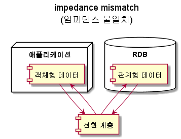

# 데이터 모델과 질의 언어
## 데이터 모델이란?
* 데이터의 관계, 접근과 그 흐름에 필요한 처리 과정에 관한 추상화된 모형이다.
* 소프트 웨어에서 개발과 유지, 보수의 기준이 되기 때문에 소프트웨어 공학의 중요한 이슈 이다. 
* 데이터 모델은 데이터 구조를 결정한다.
* 위키 : https://ko.wikipedia.org/wiki/%EB%8D%B0%EC%9D%B4%ED%84%B0_%EB%AA%A8%EB%8D%B8
######  
## 데이터 모델의 예제 
* 대부분의 애플리케이션은 하나의 데이터 모델을 다른 데이터 모델 위에 계층을 둬서 구현한다.
* 애플리케이션 개발자
  * 현실을 기반으로 객체나 데이터 구조 및 API를 모델링한다. 
* 데이터 구조
  * JSON이나 XML문서, RDB테이블, 그래프 모델같은 범용적 모델로 표현한다.
* 데이터 베이스 소프트웨어 개발자
  * 데이터 구조의 데이터들을 메모리, 디스크 또는 네트워크 상의 바이트로 표현하는 방법을 결정합니다. 
  * 이 표현은 다양한 방법으로 데이터를 질의, 탐색, 조작, 처리를 지원합니다. 
* 하드웨어 엔지니어는 전류, 빛의 파동, 자기장등의 관점에서 바이트를 표현합니다. 
######  
## 데이터 모델의 이점
* 명확한 데이터 모델을 통해서 하위 계층을 복잡성을 감춥니다. 
* 이를 통해서 다른 그룹의 사람들이 효율적으로 일할 수 있음
  * 데이터 베이스 벤더의 엔지니어
  * 데이터 베이스를 사용하는 사용자 
######  
## 관계형 모델과 문서 모델
### 관계형 모델
* 1970년에 에드가 코드에 의해서 제안됨
* 데이터는 Relation(테이블)로 구성되며 테이블은 Tuple(행)으로 표현됩니다.
* 가장 잘 알려진 데이터 모델
* RDBMS와 SQL로 정규화된 구조로 데이터를 저장하고 질의가 필요한 곳에 채택됨
######  
### 관계형 모델 예제
**UserInfo Relation(테이블)**
|UserID|UserName|Age|
|:--:|:--:|:--:|
|1234|ahn|31|
|1235|jung|25|
|1236|woong|44|
######  
### NoSQL의 탄생
#### NoSQL의 뜻은 "Not Only SQL"의 줄임말이며 RDB를 사용하지 않는다는 뜻이 아닌 여러 유형의 데이터 베이스를 사용한다는 뜻을 가집니다. 
#### NoSQL은 특정 데이터 모델을 지칭하지 않습니다. 
#### 다만 아래의 특징을 가집니다
* 대부분의 오픈 소스로 제공
* 관계형의 스키마 제한사항을 개선하기 위한 Schema-less 형태 지원
* 대규모의 데이터 셋이나 높은 쓰기 처리량을 위한 확장성 지원 
#### 웹2.0 환경과 빅테이터가 등장하면서 RDBMS의 데이터 처리 비용의 증가(scale up)로 인한 개선 필요
#### 데이터의 일관성을 포기한 대신에 여러 대의 컴퓨터에서 분산해서 저장하는 것을 목표로 개발됨
######  
### 객체 관계형 불일치 
#### 오늘날의 대부분의 애플리케이션은 객체 지향 프로그래밍 언어로 개발됨
#### 애플리케이션의 데이터를 RDB로 저장하려면 아래와 같은 전환 계층 필요
#### 
#### 액티브레코드나 하이버네이트 같은 관계 객체형 매칭 프레임워크도 있지만 완벽지원 불가

