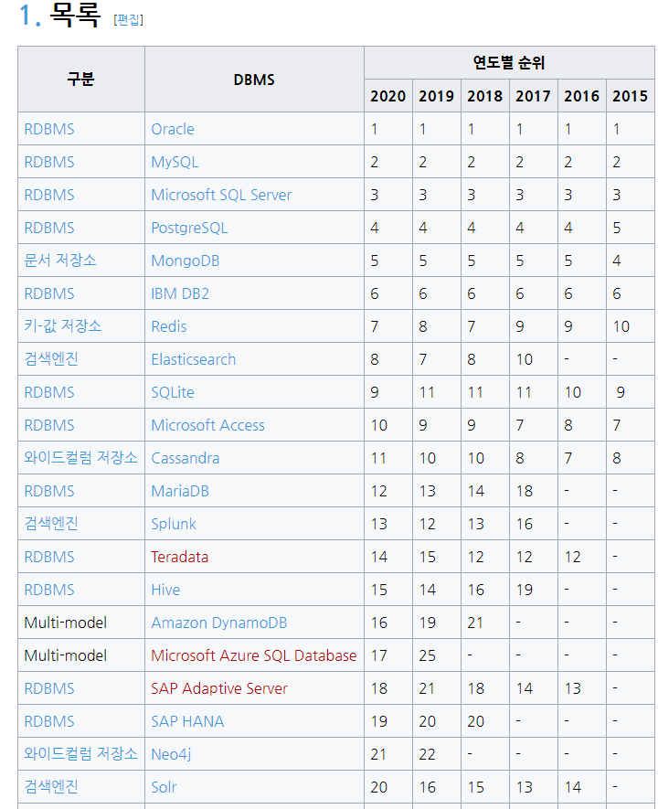
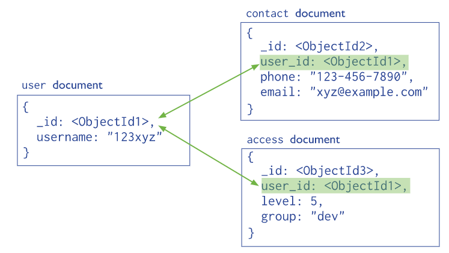

# Appendix
## 웹 2.0
#### 데이터의 소유자나 독점자 없이 누구나 쉽게 데이터를 생산하고 인터넷에 공유 할 수 있도록 한 사용자 중심의 인터넷 환경
* #### 예제) 트위터, 페이스북, 위키피디아
###### <br>
## 빅데이터 
#### 기존 데이터 베이스 관리도구의 능력을 넘어서는 대량(수십 테라바이트)의 정형 또는 비정형의 데이터 집합으로부터 가치를 추출하고 결과를 분석하는 기술 
###### <br>
## 액티브 레코드 패턴
#### 인 메모리의 객체 데이터를 관계형 데이터 베이스에 저장하는 소프트 웨어의 아키텍쳐 패턴입니다. 
#### 예제1)  
```sql
-- sql 구문
INSERT INTO parts (name, price) VALUES ('Sample part', 123.45);
```
```java
// active recode patten 
part = new Part()
part.name = "Sample part"
part.price = 123.45
part.save()
```
#### 예제2)  
```sql
-- sql 구문
b = Part.find_first("name", "gearbox")
```
```java
b = Part.find_first("name", "gearbox")
```
#### 참조 : https://en.wikipedia.org/wiki/Active_record_pattern
###### <br>
## 하이버네이트
#### 자바 언어를 위한 관계 객체 프레임 워크 
#### org.hibernate 자바 패키지 제공
#### JPA(java Persistence API) 인터페이스에 따라서 구현되어 있습니다. 
###### <br>
## MYSQL에서 JSON, XML 지원 내용
### MYSQL 5.7 버전부터 Json Data 타입을 지원함 
### MySQL 8.0부터 JSon 데이터를 RDBMS의 테이블 형식을 보여줌
###### <br>
## locality(지역성)
### 데이터를 얻기 위해서 저장소에 접근하는 것을 뜻하며
### 지역성이 높다는 것은 데이터 접근 비용이 효율적이라는 것을 뜻합니다. 
###### <br>
## DB 엔진 순위
### 참조 : https://zetawiki.com/wiki/DB%EC%97%94%EC%A7%84_%EC%88%9C%EC%9C%84
### 

###### <br>
## MongoDB 데이터 구조
### Document들이 모여서 collection이 되고 collection이 모여서 database가 됨
### RDB로 표현하면 Document는 Tuple(Row,Record)이고, collection은 Table입니다.
###### <br> 
## MongoDB의 Document Reference
### MongoDB에서 정규화 된 데이터 모델은 문서간의 참조를 통해서 관계를 설명합니다. 
### **_id** 필드를 통해서 문서간의 참조를 구현합니다. 
### 
### 
### collections들을 겹합하기 위해서 다음과 같은 기능을 제공합니다. 
* $lookup (MongoDB 3.2부터)
* $graphLookup (MongoDB 3.4부터)
###### <br>
## MongoDB 정규화 예제
### [정규화 전]
### 예제의 문서들은 동일한 publisher를 가지는 다대일 관계를 가집니다. 
```json
{
   title: "MongoDB: The Definitive Guide",
   author: [ "Kristina Chodorow", "Mike Dirolf" ],
   published_date: ISODate("2010-09-24"),
   pages: 216,
   language: "English",

   publisher: {

              name: "O'Reilly Media",

              founded: 1980,

              location: "CA"

            }

}

{
   title: "50 Tips and Tricks for MongoDB Developer",
   author: "Kristina Chodorow",
   published_date: ISODate("2011-05-06"),
   pages: 68,
   language: "English",

   publisher: {

              name: "O'Reilly Media",

              founded: 1980,

              location: "CA"

            }

}
```
### [Document Reference 사용 후]
### publisher라는 문서를 생성하고 _id필드값을 통해서 문서를 참조하도록 정규화작업 
```json
{
   _id: "oreilly",
   name: "O'Reilly Media",
   founded: 1980,
   location: "CA"
}

{
   _id: 123456789,
   title: "MongoDB: The Definitive Guide",
   author: [ "Kristina Chodorow", "Mike Dirolf" ],
   published_date: ISODate("2010-09-24"),
   pages: 216,
   language: "English",

   publisher_id: "oreilly"

}

{
   _id: 234567890,
   title: "50 Tips and Tricks for MongoDB Developer",
   author: "Kristina Chodorow",
   published_date: ISODate("2011-05-06"),
   pages: 68,
   language: "English",

   publisher_id: "oreilly"

}
```